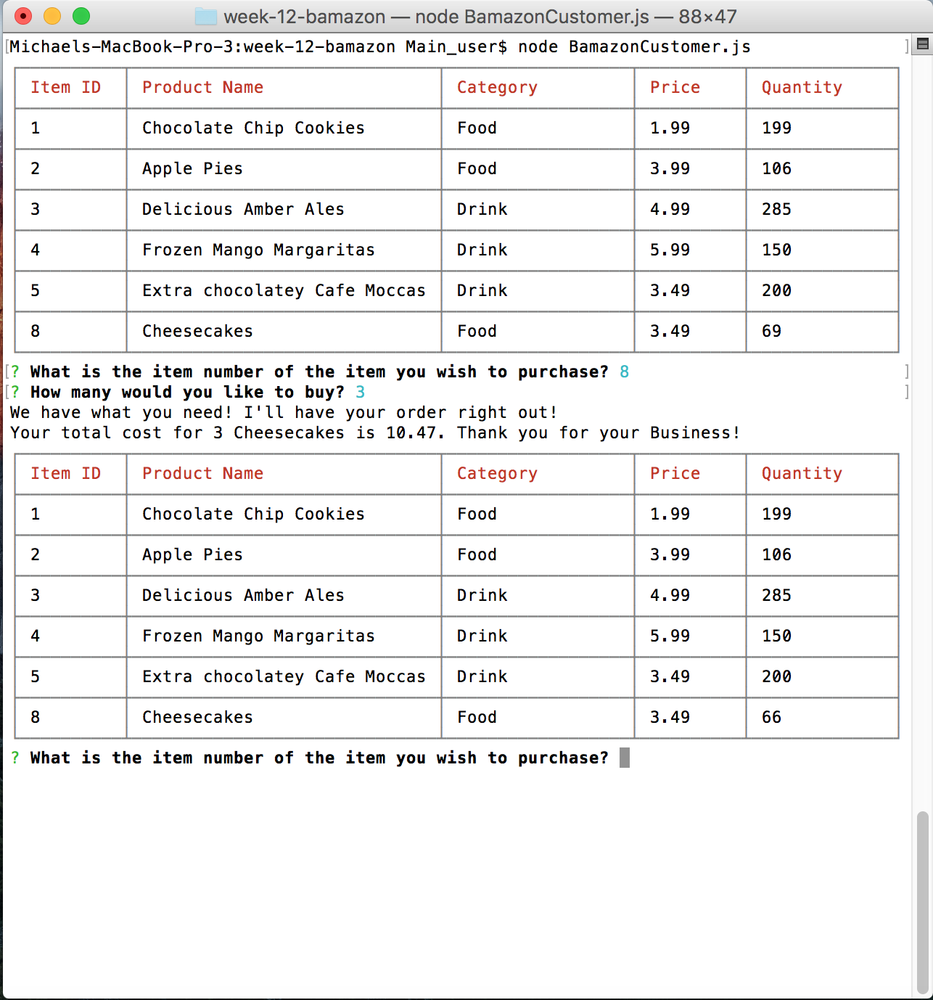
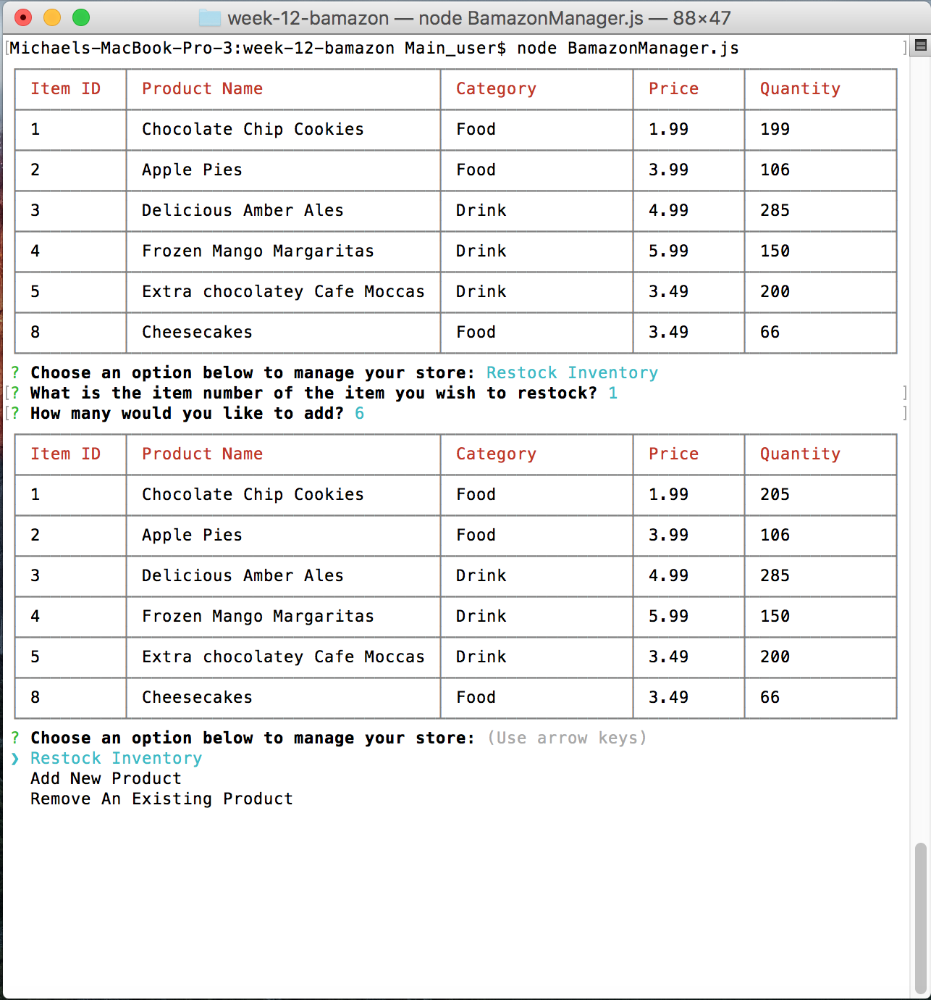

**OVERVIEW** 

This application is formatted to take a Database identical to the original instructions. It takes a database named Bamazon, a table named Products, and the columns of ItemID, ProductName, DepartmentName, Price, and StockQuantity.

This application is the Basic + the Manager application. Formatted exactly like the original file names of BamazonCustomer.js and BamazonManager.js

**FUNCTIONALITY**  

The customer app works exactly as described in the original instructions. On load, it'll load the table and display all items for sale and the coresponding data for each item. If the table looks odd, try expanding the terminal window a little bit. You'll be prompted for item number and desired quantity.

The Manager app is a little different. Like the customer app, it lists all items on load. So there's no command offered to list all items for sale. Likewise, inventory numbers are listed, so there is no "view low inventory" function. Had the database been 20+ items I would have added it.

The options within the Manager app are Restock Inventory, Add New Inventory, and Remove an Existing Product. (The remove product is a bonus feature I added.)

**NOTES** 

Again, being that this file is formatted exactly like the instructions. You should be able to plug in any database named Bamazon ,that has a table named Products, that has columns matching the original specs.

I binged the entire project in a single 8+ hour coffeeshop session. And opted to comment and add documentation on Saturday. Hence why I didn't do the executive option.

